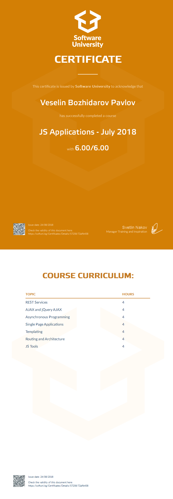

# Course: JavaScript Applications

## Topics:
01. REST Services
02. AJAX and JQuery AJAX
03. Asynchronous Programming
04. Single Page Applications
05. Templating
06. Routhing and Architecture

## Status:
Completed

## Certificate:

 
